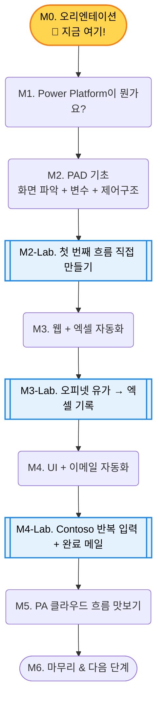

# M0. 오리엔테이션

## 🎯 학습 목표

- 오늘 하루 배울 내용의 전체 흐름을 파악합니다.
- 실습 환경이 정상적으로 준비되었는지 확인합니다.
- 이 과정의 철학과 학습 방법을 이해합니다.

## ⏱ 예상 소요 시간

| 구분 | 시간 |
|------|------|
| 강사 설명 | 10분 |
| 환경 점검 | 10분 |

---

## 오늘 배울 것 — 한눈에 보기

---

## 사전 준비 체크리스트

아래 항목을 하나씩 확인해주세요. 모두 체크되어야 실습을 시작할 수 있습니다.

- [ ] Microsoft 365 계정 로그인 확인 (`portal.office.com` 접속 가능 여부)
- [ ] Power Automate Desktop 설치 완료 (시작 메뉴에서 "Power Automate" 검색)
- [ ] `make.powerautomate.com` 접속 확인 (브라우저에서 열리는지 확인)
- [ ] Chrome 브라우저 설치 확인
- [ ] Chrome용 Power Automate Desktop 확장 설치 ([설치 링크는 PAD 콘솔 > 도구 > Chrome 확장](https://chrome.google.com/webstore/detail/microsoft-power-automate/))

<!-- SCREENSHOT: Power Automate Desktop 콘솔 메인 화면 — 첫 실행 시 보이는 화면 -->

---

## 실습 환경 안내

### 계정

| 구분 | 내용 |
|------|------|
| 계정 종류 | Microsoft 365 라이선스 계정 |
| 환경 | 기본 환경 (Default Environment) |
| 저장 위치 | OneDrive / SharePoint |

### 주의사항

{: .warning }
> **Windows Home 사용자:** 클라우드 런타임(Unattended 자동화)은 Windows Home에서 지원되지 않습니다. 오늘 실습은 Attended 모드(내 PC에서 직접 실행)만 사용하므로 문제없습니다.

{: .warning }
> **PAD 설치가 막힌 경우:** 일부 조직 정책으로 인해 PAD 설치가 차단될 수 있습니다. 이 경우 강사에게 알려주세요. 미리 준비된 대체 계정을 사용합니다.

---

## 이 과정의 철학

이 강의는 3가지 원칙으로 운영됩니다.

### 1. 개념은 최소한으로
"왜 필요한지"만 이해하면 충분합니다.  
모든 기능을 외울 필요가 없습니다.

### 2. 구현은 LLM에게 맡기세요
"어떻게 만드는지" 모르면 LLM에게 물어보면 됩니다.  
막히는 순간마다 Claude, ChatGPT, Copilot을 활용합니다.

### 3. 체험은 반드시 직접
눈으로 직접 실행해서 확인하는 것이 전부입니다.  
머릿속으로만 이해한 것은 실무에서 쓸 수 없습니다.

{: .note }
> **어렵지 않습니다.** 엑셀 함수를 써본 경험이 있다면 충분히 따라올 수 있습니다.  
> 이것만 알면 됩니다: 자동화는 "내가 반복하는 일을 기록해서 대신 실행하는 것"입니다.

---

## ✅ 핵심 정리

- 환경 준비 체크리스트 4가지를 모두 확인했습니다.
- 오늘 하루의 학습 흐름(M0 → M6)을 파악했습니다.
- 이 과정의 3가지 철학을 이해했습니다.

## 👉 다음 모듈

[M1. Power Platform 개요](./m1-overview.md)로 이동합니다.  
자동화가 왜 필요한지, PA와 PAD가 어떻게 다른지 배웁니다.
